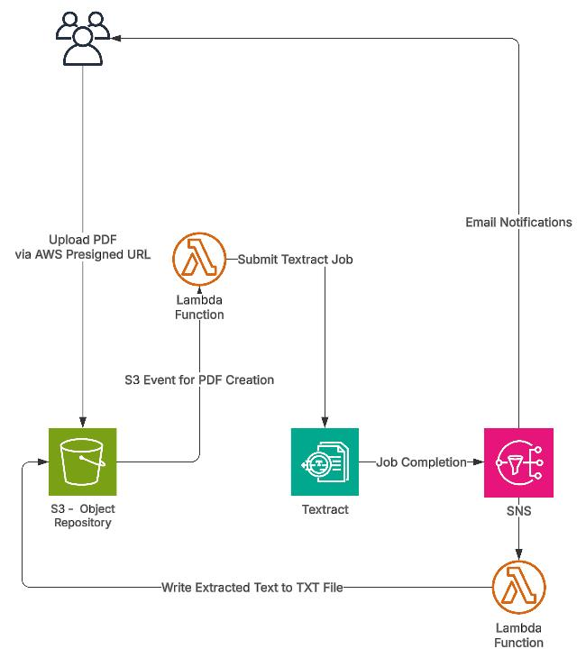

# 📄 Serverless Document Processing Pipeline (AWS CDK + Textract)

## 🚀 Overview

This project demonstrates a **serverless, event-driven document processing pipeline** built using AWS CDK and TypeScript. It automatically extracts text from uploaded documents using Amazon Textract, enabling scalable and cost-efficient document analysis.

The solution is designed with **production-ready patterns**, focusing on scalability, modularity, and extensibility.

---

## 🧱 Architecture

## 📊 Architecture Diagram



**Flow:**

1. Document uploaded to S3
2. S3 event triggers AWS Lambda
3. Lambda invokes Amazon Textract
4. Extracted text is processed and logged (extendable to storage/analytics)

---

## ⚙️ Tech Stack

- **AWS CDK (TypeScript)** – Infrastructure as Code
- **AWS Lambda** – Event-driven compute
- **Amazon S3** – Document storage
- **Amazon Textract** – AI-based text extraction
- **CloudWatch** – Logging & monitoring

---

## 🎯 Key Features

- ✅ Fully serverless architecture
- ✅ Event-driven processing (S3 → Lambda)
- ✅ Scalable with automatic concurrency handling
- ✅ Infrastructure defined using reusable CDK constructs
- ✅ Minimal operational overhead

---

## 🧠 Design Considerations

### 🔹 Scalability

- Lambda auto-scales with incoming S3 events
- Can be extended with SQS for buffering and controlled concurrency

### 🔹 Reliability

- Supports retry mechanisms via Lambda
- Can be enhanced with DLQ for failure handling

### 🔹 Cost Optimization

- Pay-per-use model (Lambda + Textract)
- No idle infrastructure

### 🔹 Security

- IAM roles follow least privilege principle
- Data remains within AWS-managed services

---

## 🔮 Future Enhancements

- 🔹 Store extracted data in DynamoDB / OpenSearch
- 🔹 Add Amazon Comprehend for entity recognition & sentiment analysis
- 🔹 Integrate Amazon Bedrock for document summarization (LLM use case)
- 🔹 Introduce SQS + DLQ for improved resilience
- 🔹 Implement async Textract for large document processing

---

## 🛠️ Deployment Steps

```bash
# Install dependencies
npm install

# Build project
npm run build

# Bootstrap (first time only)
cdk bootstrap

# Deploy stack
cdk deploy
```

---

## 🧪 How to Test

1. Upload a document (PDF/image) to the S3 bucket
2. Lambda is triggered automatically
3. Check extracted text in CloudWatch logs

---

## 💡 Use Cases

- Invoice & receipt processing
- Resume parsing
- Document digitization
- Compliance & audit workflows

---

## 🧑‍💻 Author Note

This project was built to explore **practical AI integration using AWS services**, focusing on real-world, scalable architecture patterns rather than isolated service usage.

---

## ⭐ Key Takeaway

> This project demonstrates how AI services like Textract can be seamlessly integrated into a scalable, serverless architecture using modern Infrastructure as Code practices.
